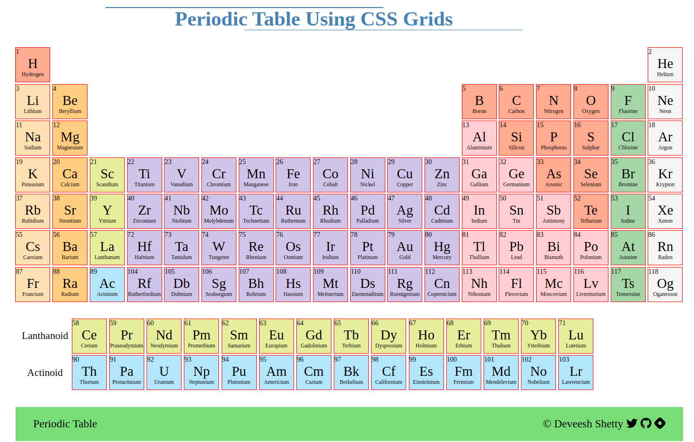
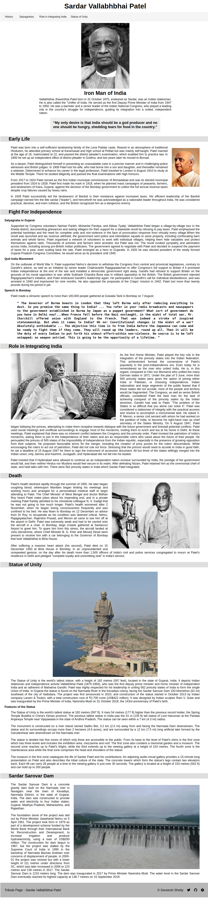
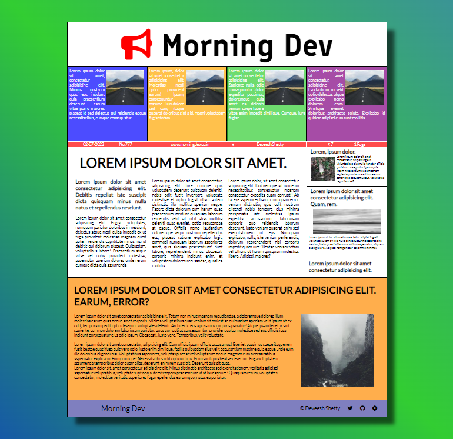
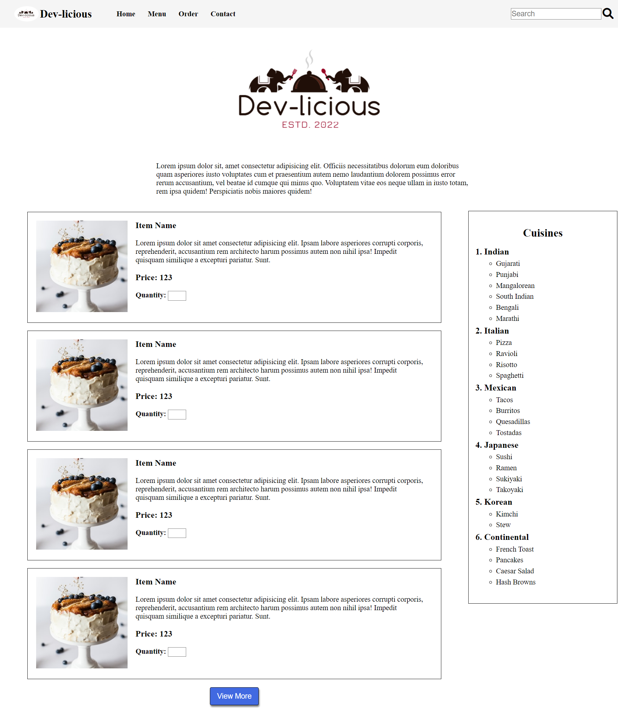
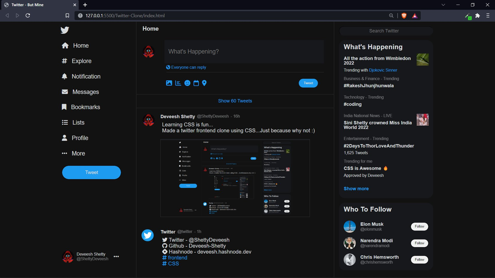
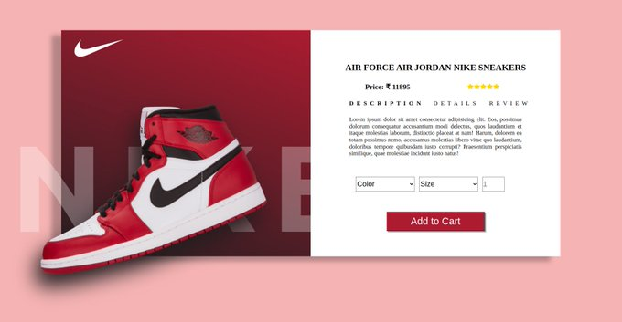
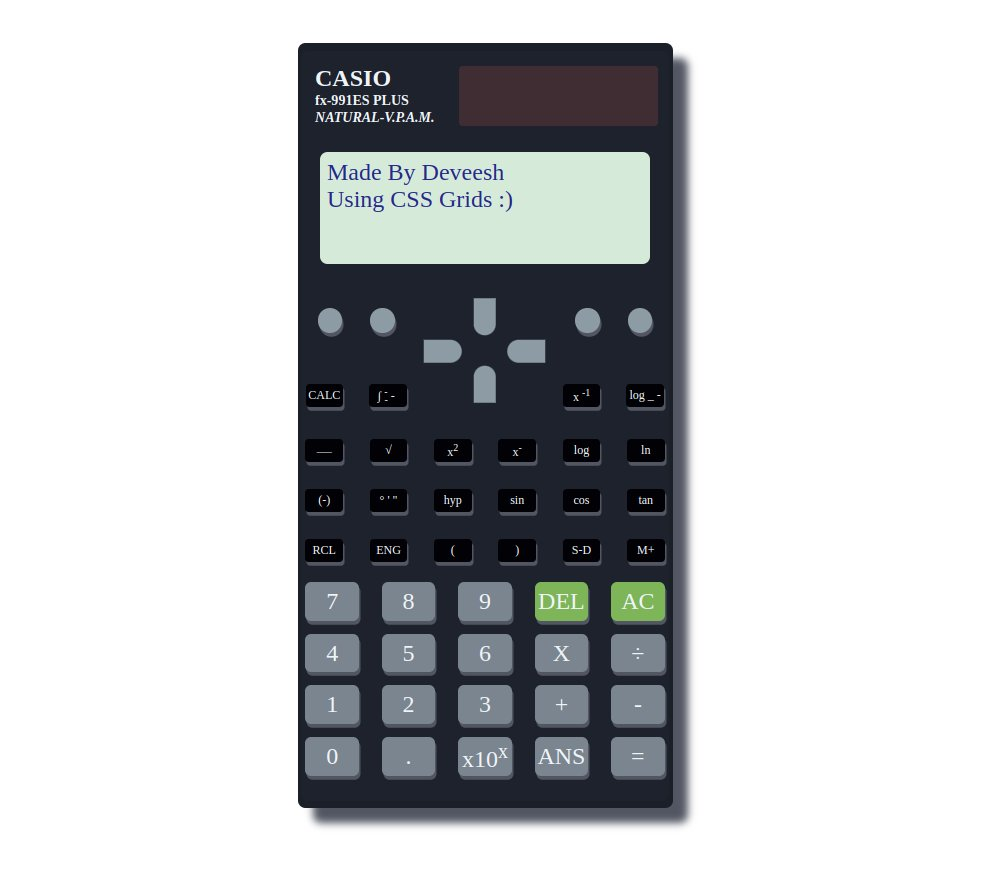
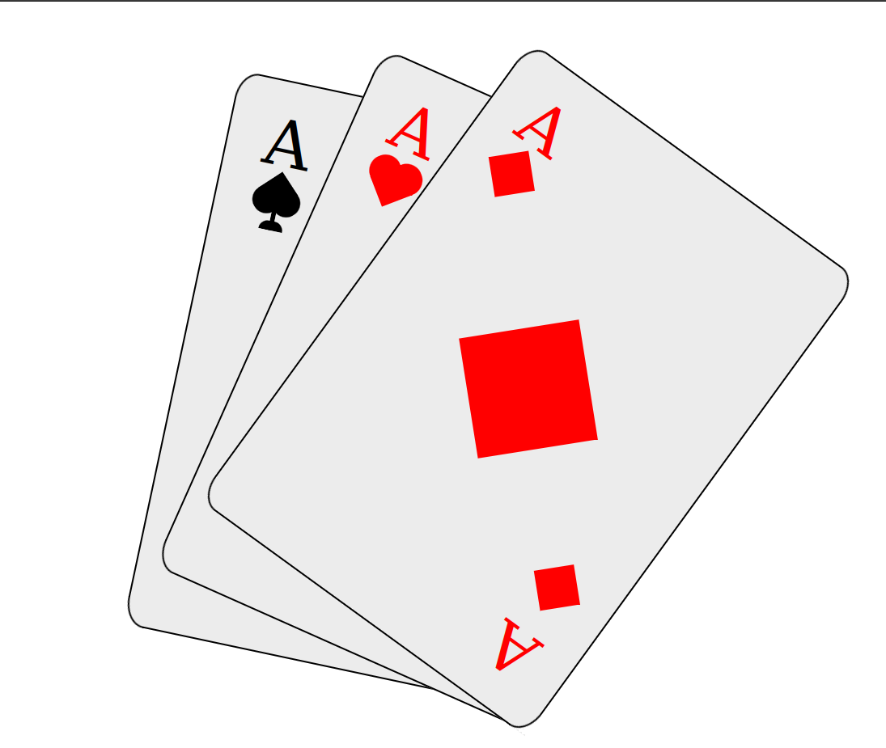

    # 30 Days of Code 
## I started 30 days of code for Frontend Development.
### It is mainly focused on HTML, CSS and little JavaScript. 😄
### I am following some tutorials and also doing projects to be good with it and practicing is the best way of learning 🚀

---

## So below is my day-to-day journey...
 

## Started HTML
**Day 1** - Basic HTML tags.

**Day 2** - Form Elements, Input Types, Input Attributes.

**Day 3** - Semantic HTML, Made a form page, some small projects on HTML.

## Started CSS
**Day 4** - Messed a little with CSS.

**Day 5** - Started freeCodeCamp tutorial... learned CSS basics.

**Day 6** - Learned Selectors and Pseudo-selectors.

**Day 7** - Learned CSS box model.

**Day 8** - Used flexbox and its properties. Used Grid layout then learned about transitions and animations.

Completed freeCodeCamp tutorial.

**Day 9** - Made a flexbox card which is responsive.

**Day 10** - Practiced grid layout and made a HTML structure page.

**Day 11** - Did more grid layout.

**Day 12** - Made a page showing various animations.

Started Periodic Table .

**Day 13** - Completed Periodic Table.

 

> Periodic Table

Also started tribute page project.

 

**Day 14** - Completed the tribute page for Sardar Vallabhbhai Patel.

 

> Tribute Page - Sardar Vallabhbhai Patel

Also started a newspaper layout project.

 

**Day 15** - Completed the newspaper layout project.

 

> Newspaper Layout

Started a new project which is a restaurant page.

 

**Day 16** - Completed the restaurant page, also added contact page and order page to it.

 

> Restaurant Page

 

**Day 17** - Started a frontend clone of twitter.

**Day 18** - Completed the twitter clone

 

> Twitter Frontend Clone

 

**Day 19** - Finished the HTML and bsic CSS for a new project, Nike Product Card.

**Day 20** - Added CSS to the Image side and partially finished the project.

**Day 21** - Finished the Nike Product Card, some flaws here and there, but didn't want to waste much time in that.

> NIke Product Card

 

**Day 22** - Made Ironman using CSS box shadows, was a fun project to work on, will do more in my free time.

> Ironman using CSS box shadows

 

**P.S.** The progress for next 4-5 days will be slow because of my Internal Examinations.
 

**Day 23** - Started working on making scientific calculator.

**Day 24** - Done with the HTML of the calculator, just some CSS is remaining.

**Day 25** - Finished the scientific calculator using CSS grids, wanted to do more detailed one but it was taking little more time and I had some other stuffs to do.

> Scientfic Calculator using CSS

 

**Starting javaScript from tomorrow :)**

**Day 26** - Started Javascript basics following Code with Mosh's tutorial.

Completed the tutorial - learned the basics of JS variables, arrays, objects and functions.

Started freeCodeCamp JS course going to be a long run (:

**Day 27** - Did one small project of freeCodeCamp tutorial

Started Traversy Media javaScript tutorial and almost finished it all the learnings are in javascript-tutorial folder.

**Day 28** - Completed the Traversy Media Javascript beginner playlist.

**Day 29** - Completed a playlist of 4 videos of Traversy Media for DOM manipulation

All the commands are there in DOM-js tutorial, with comments of what they do.

**Day 30** - Made 3 card using pure CSS.... they are stacked on top of each other even the pattern is made purely using CSS.
On hover the come in front in front and you can see the full card.

 

## This was meant to be a 100 days of code but I divided it into 30 days for HTML & CSS and will start another one for javaScript.
